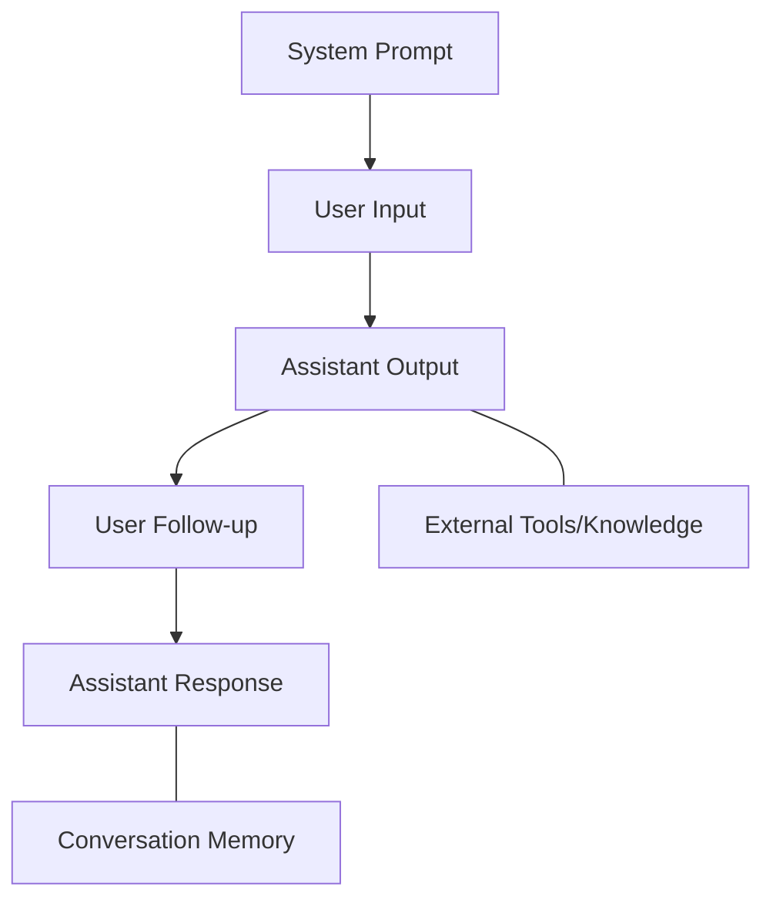
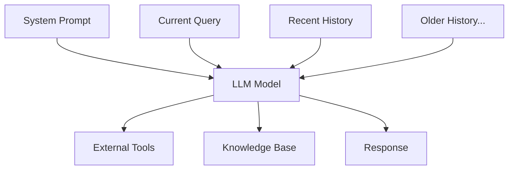

# Foundations

<!-- TIME: 10 minutes total -->

## Overview

**Goal: establish a shared mental model**

* Leading models, personalities, use-cases
* Anatomy of a conversation
* Context management

## Models: Personalities
<!-- hide-title --> 

## Models: Personalities

* **Gemini 2.5 Pro** – smart, TODO: Ted
* **o3** – slow, very smart, requires lots of context
* **Claude 3.7 Sonnet** – fast, excels at tool use, may rewrite React from scratch if you don't watch it closely

## Models: Use Cases

* **Gemini 2.5 Pro** - Day-to-day work with complex codebases
* **o3** - Solving tough problems given copious context
* **Claude 3.7 Sonnet** - Vibe coding, agentic workflows

## Anatomy of a Conversation

<!-- A mermaid diagram showing a richer conversation flow -->

## Context Management

